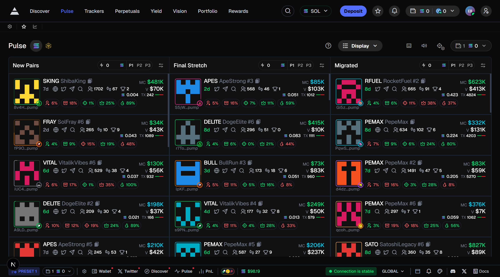
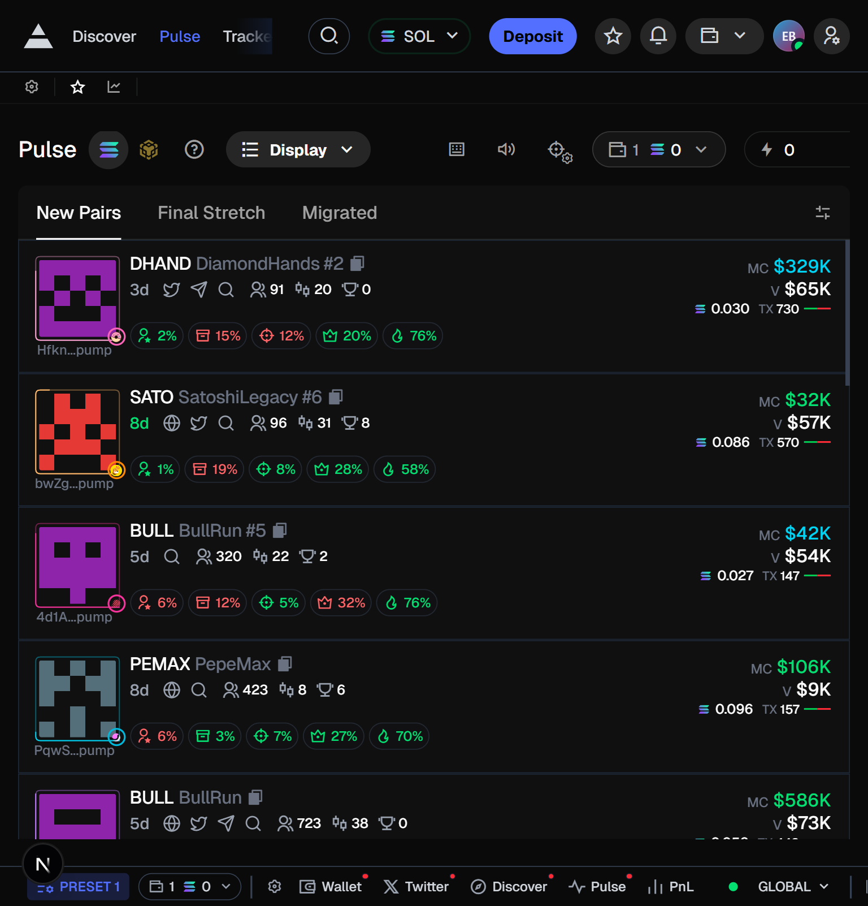
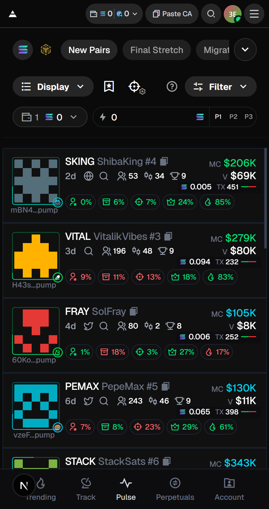
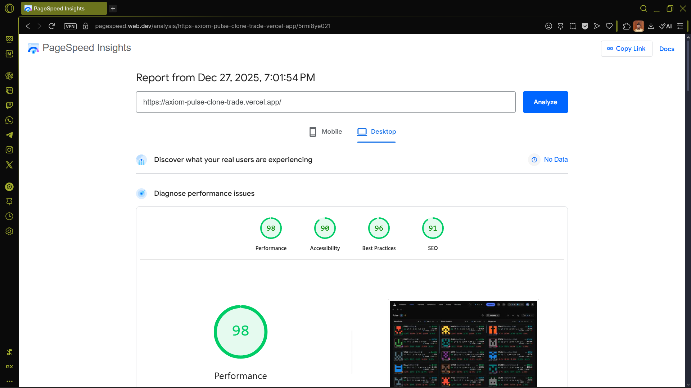
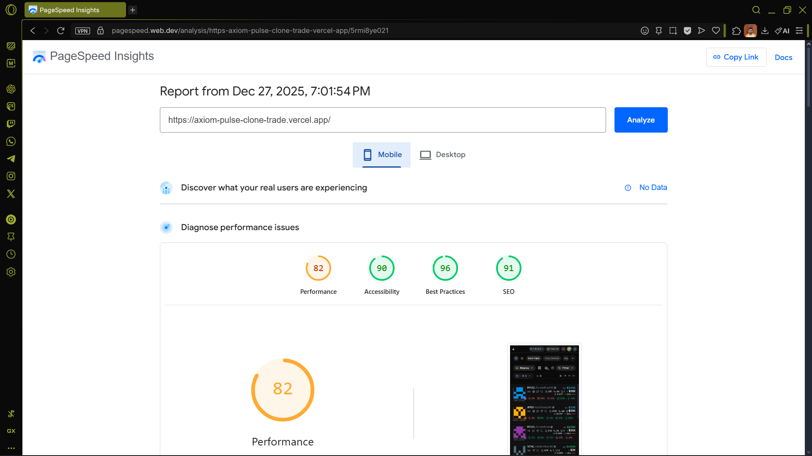

# Axiom Pulse Clone

A real-time cryptocurrency token tracking platform with live market data updates and intelligent token scoring. This project replicates the core functionality of Axiom Pulse, featuring a three-column layout that displays tokens across different lifecycle stages with WebSocket-powered live updates.

## Live Demo

**[https://axiom-pulse-clone-trade.vercel.app](https://axiom-pulse-clone-trade.vercel.app)**

## Screenshots


_Desktop interface with three-column token grid_


_Tablet responsive layout_


_Mobile optimized interface_

---

## Table of Contents

1. [What is This Project](#what-is-this-project)
2. [Technology Stack](#technology-stack)
3. [Architecture Overview](#architecture-overview)
4. [Client Application](#client-application)
5. [Server Application](#server-application)
6. [Token Scoring Algorithm](#token-scoring-algorithm)
7. [Mock Data Generation & Simulation](#mock-data-generation--simulation)
8. [Redux Store Architecture](#redux-store-architecture)
9. [Key Features](#key-features)
10. [Getting Started](#getting-started)
11. [Project Structure](#project-structure)
12. [Development Tools](#development-tools)

---

## What is This Project

**Axiom Pulse Clone** is a **frontend demonstration project** built as a development assessment. This is **not a functional trading platform** — it's a showcase of advanced frontend engineering skills, focusing on building a complex, performant user interface with realistic real-time data simulation.

The project demonstrates proficiency in:

- **Modern React patterns** (App Router, Server Components, Client Components)
- **Complex state management** (Redux Toolkit with normalized state)
- **Real-time data handling** (WebSocket integration, delta updates)
- **Performance optimization** (virtual scrolling, memoization, efficient re-renders)
- **Responsive design** (mobile-first, adaptive layouts)
- **TypeScript** (full type safety across the application)

While it includes a Node.js backend for data simulation, the backend exists solely to support the frontend demonstration. The entire focus is on **frontend architecture, UI/UX implementation, and client-side performance**.

**Technical Demonstration Features:**

- Real-time token data updates via WebSocket with delta synchronization
- Three-stage token lifecycle simulation with automatic transitions
- Multi-factor scoring algorithm with historical snapshot tracking
- Virtual scrolling for efficient rendering of large datasets
- Responsive design optimized for desktop, tablet, and mobile devices
- Live market data simulation for cryptocurrencies (BTC, ETH, SOL)

---

## Technology Stack

### Frontend

- **[Next.js 16](https://nextjs.org/)** - React framework with App Router
- **[React 19](https://react.dev/)** - UI library with latest concurrent features
- **[TypeScript](https://www.typescriptlang.org/)** - Type-safe development
- **[Redux Toolkit](https://redux-toolkit.js.org/)** - State management with RTK Query
- **[Tailwind CSS 4](https://tailwindcss.com/)** - Utility-first styling with custom theme
- **[Shadcn UI](https://ui.shadcn.com/)** - Accessible component library
- **[TanStack Virtual](https://tanstack.com/virtual)** - Virtualized list rendering
- **[Remix Icon](https://remixicon.com/)** - Icon library

### Backend

- **[Express](https://expressjs.com/)** - Node.js web framework
- **[WebSocket (ws)](https://github.com/websockets/ws)** - Real-time bidirectional communication
- **[dotenv](https://github.com/motdotla/dotenv)** - Environment configuration
- **[CORS](https://github.com/expressjs/cors)** - Cross-origin resource sharing

---

## Architecture Overview

The application follows a client-server architecture with real-time data synchronization:

```
┌─────────────────────────────────────────────────────────────┐
│                        CLIENT (Next.js)                      │
│  ┌──────────────┐  ┌──────────────┐  ┌──────────────┐     │
│  │  New Pairs   │  │Final Stretch │  │  Migrated    │     │
│  │   Column     │  │   Column     │  │   Column     │     │
│  └──────────────┘  └──────────────┘  └──────────────┘     │
│           │                 │                 │             │
│           └─────────────────┴─────────────────┘             │
│                          │                                  │
│                   Redux Store                               │
│              (Data + UI + TokenHistory)                     │
│                          │                                  │
│                    WebSocket Client                         │
└──────────────────────────┬──────────────────────────────────┘
                           │
                  ┌────────┴─────────┐
                  │   HTTP / WS      │
                  └────────┬─────────┘
                           │
┌──────────────────────────┴──────────────────────────────────┐
│                   SERVER (Express + WS)                      │
│                                                              │
│  ┌────────────────┐    ┌────────────────┐                  │
│  │  REST APIs     │    │  WebSocket     │                  │
│  │  /api/tokens   │    │  Handlers      │                  │
│  │  /api/market   │    │                │                  │
│  └────────────────┘    └────────────────┘                  │
│           │                     │                           │
│  ┌────────┴─────────────────────┴────────┐                 │
│  │     Token Update Manager               │                │
│  │     (Lifecycle Simulation Engine)      │                │
│  └────────────────────────────────────────┘                 │
└─────────────────────────────────────────────────────────────┘
```

**Data Flow:**

1. **Initial Load**: Client fetches token snapshot via REST API
2. **Real-time Updates**: WebSocket streams delta updates every 2 seconds
3. **State Management**: Redux stores token data, UI state, and historical snapshots
4. **Scoring**: Client-side algorithm calculates token priority scores
5. **Rendering**: Virtual scrolling displays sorted tokens by score

---

## Client Application

### Overview

The client is a Next.js application built with the App Router pattern, featuring a three-column grid layout that adapts to different screen sizes. Each column represents a different stage in the token lifecycle.

### Key Components

#### 1. **Token Grid System**

- **TokenColumn**: Virtualized column component with dynamic sorting
- **TokenCard**: Individual token display with metrics and actions
- **TokenGridHeader**: Room tab navigation (New Pairs, Final Stretch, Migrated)

#### 2. **Layout Components**

- **MobileHeader**: Collapsible mobile navigation with chain selector
- **PulseHeader**: Desktop header with controls and flash trading input
- **ControlBar**: Settings, favorites, and chart controls
- **ColumnHeader**: Column title with filter and flash input

#### 3. **WebSocket Integration**

Real-time updates are managed through a custom WebSocket hook (`useWebSocket`) that:

- Establishes connection on component mount
- Handles reconnection with exponential backoff
- Processes delta updates and applies them to Redux store
- Manages room transitions as tokens move through lifecycle stages

#### 4. **State Management Flow**

```typescript
// Initial data fetch
GET /api/tokens → dataSlice.setTokens()
GET /api/market → dataSlice.setMarket()

// WebSocket updates
WS token_update → dataSlice.updateToken()
WS market_update → dataSlice.setMarket()

// Scoring system
dataSlice changes → tokenHistorySlice.updateTokenHistory()
                 → tokenHistorySlice calculates score
                 → TokenColumn sorts by score
```

#### 5. **Virtual Scrolling Implementation**

Uses TanStack Virtual to efficiently render large lists:

- Estimates item height at ~118px
- Maintains 5 items overscan for smooth scrolling
- Pauses reordering on hover to prevent UI jumping
- Absolute positioning for virtual items

#### 6. **Responsive Design**

- **Mobile** (<640px): Single column, collapsible header
- **Tablet** (640-1024px): Two columns, simplified controls
- **Desktop** (1024px+): Three columns, full feature set

#### 7. **Performance Optimization**

The application achieves excellent performance scores across all metrics:

**Desktop Performance**



**Mobile Performance**



**Optimization Techniques:**

- Virtual scrolling with TanStack Virtual
- Memoized Redux selectors to prevent unnecessary recalculations
- Code splitting with Next.js dynamic imports
- Optimized images with Next.js Image component
- Delta-based WebSocket updates for minimal bandwidth
- Debounced search and hover-pause for smooth interactions

### The Scoring Algorithm (Overview)

Tokens are ranked using a multi-factor scoring system that analyzes:

- Buy vs. sell pressure
- Transaction momentum
- Holder growth trends
- Volume expansion
- Recent activity (within 10 seconds)
- Token age (bonus for <3 minutes)

See [Token Scoring Algorithm](#token-scoring-algorithm) for detailed explanation.

---

## Server Application

### Overview

The server is an Express application with integrated WebSocket support that generates realistic token market data and streams updates to connected clients. It simulates a complete token lifecycle ecosystem.

### Core Modules

#### 1. **Token Schema** (`tokenSchema.js`)

Defines the structure of token objects with both static and dynamic fields:

- **Static**: ID, name, ticker, creation date, protocol, social links
- **Dynamic**: Market cap, volume, price, bonding progress, holder count

#### 2. **Token Update Manager** (`tokenUpdates.js`)

Manages the token update cycle:

- Broadcasts single token updates every 2 seconds
- Determines token room based on bonding progress
- Handles room transitions with state tracking
- Maintains WebSocket client connections

#### 3. **Market Update Manager** (`marketUpdates.js`)

Simulates cryptocurrency market fluctuations:

- Updates BTC, ETH, and SOL prices every 5 seconds
- Applies realistic price movements (±0.5% per update)
- Tracks 24h change and volume metrics

#### 4. **Token Lifecycle Simulation**

The server implements a complete token lifecycle with automatic transitions:

```
┌──────────────┐         ┌──────────────────┐         ┌─────────────┐
│  New Pairs   │  60%→   │  Final Stretch   │  100%→  │  Migrated   │
│              │ bonding │                  │ bonding │             │
│  25-60%      │ ───────→│  60-100%         │────────→│  100%       │
└──────────────┘         └──────────────────┘         └─────────────┘
       ↑                                                      │
       │                  After 1.7 minutes                   │
       └──────────────────────────────────────────────────────┘
                         (Reset to new state)
```

**Transition Logic:**

1. **New Pairs → Final Stretch**: When bonding progress reaches 60%
2. **Final Stretch → Migrated**: When bonding progress reaches 100%
3. **Migrated → New Pairs**: After 1.7 minutes, token resets with new metrics

#### 5. **REST API Endpoints**

```
GET  /api/tokens         - Initial token snapshot (all rooms)
GET  /api/tokens/:room   - Tokens for specific room
GET  /api/market         - Current market data (BTC, ETH, SOL)
GET  /api/health         - Server health check
```

#### 6. **WebSocket Events**

**Client → Server:**

- `join_tokens` - Subscribe to token updates
- `leave_tokens` - Unsubscribe from token updates
- `join_market` - Subscribe to market updates

**Server → Client:**

- `token_update` - Delta update for single token
- `market_update` - New market prices

#### 7. **Data Persistence**

Token and market data are persisted to JSON files:

- `tokens.json` - Fixed token IDs for consistent updates
- `market.json` - Last known market state

---

## Token Scoring Algorithm

### Purpose

The scoring algorithm prioritizes tokens that show high trading activity, positive momentum, and growth potential. It uses historical snapshots to calculate deltas and assign priority rankings.

### Data Structure

Each token maintains a history of three snapshots:

```typescript
interface TokenSnapshot {
  buy: number; // Buy transactions
  sell: number; // Sell transactions
  tx: number; // Total transactions
  holders: number; // Holder count
  volume: number; // 24h volume
  lastTradeAt: string; // Timestamp
}

interface TokenHistory {
  current: TokenSnapshot; // Latest data
  t1: TokenSnapshot; // Previous snapshot
  t2: TokenSnapshot; // Snapshot before t1
}
```

### Calculation Process

#### Step 1: Calculate Current Deltas

Compare current state with previous snapshot (t1):

```typescript
const buyDelta = current.buy - t1.buy;
const sellDelta = current.sell - t1.sell;
const txDelta = current.tx - t1.tx;
const holderDelta = current.holders - t1.holders;
const volumeDelta = current.volume - t1.volume;
```

#### Step 2: Calculate Previous Deltas

Compare previous state (t1) with older snapshot (t2):

```typescript
const buyDeltaPrev = t1.buy - t2.buy;
const sellDeltaPrev = t1.sell - t2.sell;
const txDeltaPrev = t1.tx - t2.tx;
const volumeDeltaPrev = t1.volume - t2.volume;
```

#### Step 3: Determine Flags

```typescript
// Activity flags
isRecentlyActive = (now - lastTradeAt) <= 10 seconds
hasTransactionActivity = txDelta > 0
isYoung = tokenAge < 3 minutes

// Momentum flags
hasBuyPressure = buyDelta > sellDelta
hasSellPressure = sellDelta >= buyDelta
hasMomentumIncreasing = buyDelta > buyDeltaPrev
hasTxAcceleration = txDelta > txDeltaPrev

// Growth flags
hasHolderGrowth = holderDelta > 0
hasVolumeExpansion = volumeDelta > 0 AND volumeDelta > volumeDeltaPrev
```

#### Step 4: Calculate Score

**Points Added:**

- `+2` if `hasBuyPressure` (more buyers than sellers)
- `+1` if `hasMomentumIncreasing` (acceleration in buying)
- `+1` if `hasTransactionActivity` (recent trades)
- `+1` if `hasTxAcceleration` (increasing tx rate)
- `+1` if `hasHolderGrowth` (new holders)
- `+1` if `isYoung` (token age < 3 minutes)

**Points Subtracted:**

- `-2` if `hasSellPressure` (more sellers than buyers)
- `-1` if not `isRecentlyActive` (no trades in 10s)
- `-1` if `holderDelta <= 0` (losing holders)

**Score Range**: Typically -4 to +7

### Sorting Strategy

Tokens are sorted in the following order:

1. **Primary**: Score (descending) - higher scores appear first
2. **Secondary**: Last trade timestamp (descending) - recent trades prioritized

### Priority Flags

```typescript
isTopPriority = rank <= 5        // Top 5 tokens (highlighted)
isDeprioritized = score <= 2 OR !isRecentlyActive
```

### Example Scenarios

**High Score Token (+6)**

- New token (< 3min): +1
- Buy pressure: +2
- Momentum increasing: +1
- Transaction acceleration: +1
- Holder growth: +1

**Low Score Token (-2)**

- Sell pressure: -2
- No recent activity: -1
- Losing holders: -1
- Some transaction activity: +1
- Net: -2

---

## Mock Data Generation & Simulation

### Token Generation Process

#### 1. **Static Token Data**

Generated once per token with fixed attributes:

```javascript
{
  id: "abc123pump",           // Unique identifier
  name: "SolFray",            // Human-readable name
  ticker: "FRAY",             // Trading symbol
  image_url: "...",           // Avatar (DiceBear API)
  created_at: ISO_timestamp,  // Creation date
  protocol: {                 // Launch platform
    id: "pump",
    label: "Pump"
  },
  room: "new_pairs",          // Initial room assignment
  roomEnteredAt: ISO_timestamp
}
```

#### 2. **Dynamic Token Data**

Regenerated with each update to simulate market changes:

```javascript
metrics: {
  market_cap: 5000 - 1000000,      // Random range
  volume_24h: 1000 - 100000,
  price_sol: 0.000001 - 0.1,
  transactions: 100 - 5000,
  bonding_progress: 0 - 100,       // Lifecycle stage
  price_change_dir: "up" | "down"
}

distribution: {
  holders: 50 - 1000,
  pro_traders: 0 - 100,
  dev_status: {
    is_migrated: boolean,
    dev_hold_percent: 0 - 20
  }
}

security: {
  lp_burned: 0 - 100,              // Liquidity pool burn %
  is_honeypot: boolean,            // Scam flag
  top_10_holders_pct: 10 - 40
}
```

### Update Simulation Algorithm

The `generateDeltaUpdate()` function simulates realistic market behavior:

#### Phase 1: Check for Room Transitions

```javascript
// New Pairs → Final Stretch (bonding >= 60%)
if (room === 'new_pairs' && bonding_progress >= 60) {
  newRoom = 'final_stretch';
}

// Final Stretch → Migrated (bonding = 100%)
if (room === 'final_stretch' && bonding_progress >= 100) {
  newRoom = 'migrated';
  dev_status.is_migrated = true;
}

// Migrated → New Pairs (after 1.7 minutes)
if (room === 'migrated' && timeInRoom >= 102 seconds) {
  newRoom = 'new_pairs';
  // Reset all metrics to new token state
}
```

#### Phase 2: Apply Random Market Changes

```javascript
// Price fluctuation (±10%)
priceChange = (Math.random() - 0.5) * 0.1;
market_cap *= 1 + priceChange;

// Volume change (-40% to +60%)
volumeChange = (Math.random() - 0.4) * 0.2;
volume_24h *= 1 + volumeChange;

// Bonding progress increase (room-dependent)
if (room === 'new_pairs') {
  bonding_progress += Math.random() * 3.5; // 0-3.5% per update
} else if (room === 'final_stretch') {
  bonding_progress += Math.random() * 1.8; // 0-1.8% per update
}

// Transaction count increase
transactions += Math.floor(Math.random() * 50);

// Holder changes (60% gain, 40% loss)
holders +=
  Math.random() > 0.4
    ? Math.floor(Math.random() * 10)
    : -Math.floor(Math.random() * 5);
```

#### Phase 3: Security & Distribution Updates

```javascript
// Occasional security metric changes (10% chance)
if (Math.random() < 0.1) {
  lp_burned += Math.random() * 5;
  top_10_holders_pct += (Math.random() - 0.5) * 2;
}

// Distribution shifts (20% chance)
if (Math.random() < 0.2) {
  bundle_holding += (Math.random() - 0.5) * 3;
  snipers_holding += (Math.random() - 0.5) * 2;
}
```

### Broadcast Strategy

The server broadcasts one token update every 2 seconds:

1. Select random token from pool
2. Capture current room (before update)
3. Generate delta with `generateDeltaUpdate()`
4. Apply changes to token in memory
5. Determine new room (after update)
6. Broadcast delta with room transition info
7. Log transition if room changed

### Simulation Parameters

```javascript
TOKEN_COUNT = 45              // Total tokens in system
UPDATE_INTERVAL = 2000ms      // One token every 2s
MARKET_UPDATE_INTERVAL = 5000ms  // Market data every 5s

// Lifecycle timing
NEW_PAIRS_DURATION = ~60-120s     // Time to reach 60%
FINAL_STRETCH_DURATION = ~40-80s  // Time to reach 100%
MIGRATED_DURATION = 102s          // Fixed reset time
```

---

## Redux Store Architecture

The application uses three Redux slices to manage different aspects of state:

### 1. Data Slice (`dataSlice.ts`)

**Purpose**: Stores raw token and market data

**State Structure**:

```typescript
interface DataState {
  tokens: {
    new_pairs: { [tokenId: string]: Token };
    final_stretch: { [tokenId: string]: Token };
    migrated: { [tokenId: string]: Token };
  };
  market: {
    btc: MarketCoin;
    eth: MarketCoin;
    sol: MarketCoin;
  };
  isLoading: boolean;
  error: string | null;
  lastUpdate: string | null;
}
```

**Key Actions**:

- `setTokens(tokens)` - Load initial token snapshot
- `updateToken({ room, tokenId, delta })` - Apply delta update
- `moveToken({ oldRoom, newRoom, tokenId })` - Handle room transitions
- `setMarket(marketData)` - Update cryptocurrency prices

**Room Management**:
Tokens are organized by room using nested objects for O(1) lookup. When a token transitions rooms, it's removed from the old room and added to the new room atomically.

### 2. UI Slice (`uiSlice.ts`)

**Purpose**: Manages user interface state and preferences

**State Structure**:

```typescript
interface UIState {
  wsConnected: boolean; // WebSocket connection status
  activeRoom: 'new_pairs' | 'final_stretch' | 'migrated' | 'all';
  searchQuery: string; // Token search filter
  selectedTokenId: string | null;
  selectedPreset: number; // Flash trading preset (1-3)
  displayMode: 'list' | 'grid' | 'compact';
  activeNavTab: string; // Navigation tab selection
}
```

**Key Actions**:

- `setWsConnected(boolean)` - Update connection status
- `setActiveRoom(room)` - Change active room filter
- `setSearchQuery(query)` - Update search filter
- `selectToken(tokenId)` - Select token for details

### 3. Token History Slice (`tokenHistorySlice.ts`)

**Purpose**: Maintains historical snapshots and calculates token scores

**State Structure**:

```typescript
interface TokenHistoryState {
  history: {
    [tokenId: string]: {
      current: TokenSnapshot;
      t1: TokenSnapshot | null;
      t2: TokenSnapshot | null;
    };
  };
  scores: {
    [tokenId: string]: TokenScore;
  };
}
```

**Key Actions**:

- `initializeHistory({ tokenId, metrics, distribution })` - Create initial snapshot
- `updateTokenHistory({ tokenId, metrics, distribution })` - Add new snapshot and shift old ones
- Score calculation happens automatically on each update

**Snapshot Shifting**:

```
Update arrives → current becomes t1 → t1 becomes t2 → new data becomes current
```

### Selectors (`selectors.ts`)

Memoized selectors optimize performance by preventing unnecessary recalculations:

```typescript
// Filtered and sorted tokens with scores
selectSortedTokensWithScores = createSelector(
  [selectActiveRoomTokens, selectTokenScores, selectSearchQuery],
  (tokens, scores, query) => {
    // 1. Filter by search query
    // 2. Map tokens with scores
    // 3. Sort by score, then by lastTradeAt
    // 4. Add rank and priority flags
  }
);

// Token counts per room
selectTokenCounts = createSelector(
  [selectNewPairsTokens, selectFinalStretchTokens, selectMigratedTokens],
  (newPairs, finalStretch, migrated) => ({
    new_pairs: Object.keys(newPairs).length,
    final_stretch: Object.keys(finalStretch).length,
    migrated: Object.keys(migrated).length,
    total: /* sum of all */
  })
);
```

### Data Flow Example

```
1. WebSocket receives token_update event
   ↓
2. dataSlice.updateToken() applies delta
   ↓
3. tokenHistorySlice.updateTokenHistory() creates snapshot
   ↓
4. Score calculated automatically
   ↓
5. selectSortedTokensWithScores recomputes
   ↓
6. TokenColumn re-renders with new order
```

---

## Key Features

### 1. **Real-Time Updates**

- WebSocket connection with automatic reconnection
- Delta-based updates for efficient bandwidth usage
- Live market data for BTC, ETH, and SOL

### 2. **Intelligent Token Ranking**

- Multi-factor scoring algorithm
- Historical snapshot comparison
- Automatic priority highlighting

### 3. **Lifecycle Simulation**

- Three-stage token progression
- Automatic room transitions
- Realistic bonding curve progression

### 4. **Performance Optimization**

- Virtual scrolling for large lists
- Memoized selectors with Redux Toolkit
- Debounced search queries
- Hover-based update pausing

### 5. **Responsive Design**

- Mobile-first approach
- Collapsible navigation
- Adaptive column layout
- Touch-optimized controls

### 6. **Developer Experience**

- Full TypeScript coverage
- Component-based architecture
- Hot module replacement
- Environment-based configuration

---

## Getting Started

### Prerequisites

- Node.js 18+ and npm/pnpm
- Modern browser with WebSocket support

### Installation

```bash
# Clone the repository
git clone <repository-url>
cd axiom-pulse-clone

# Install client dependencies
cd client
npm install

# Install server dependencies
cd ../server
npm install
```

### Configuration

**Client** (`.env.local`):

```env
NEXT_PUBLIC_WS_URL=ws://localhost:5000
NEXT_PUBLIC_API_URL=http://localhost:5000
```

**Server** (`.env`):

```env
PORT=5000
DEV=true
```

### Running the Application

**Development Mode**:

```bash
# Terminal 1: Start server
cd server
npm run dev

# Terminal 2: Start client
cd client
npm run dev
```

**Production Build**:

```bash
# Build client
cd client
npm run build
npm start

# Run server
cd server
npm start
```

Access the application at:

- **Client**: http://localhost:3000
- **Server API**: http://localhost:5000
- **WebSocket**: ws://localhost:5000

---

## Project Structure

```
axiom-pulse-clone/
├── client/
│   ├── app/
│   │   ├── components/
│   │   │   ├── layout/          # Header, navigation, controls
│   │   │   └── tokens/          # Token cards, columns, grid
│   │   ├── pulse/               # Main pulse page
│   │   └── globals.css          # Global styles
│   ├── store/
│   │   ├── dataSlice.ts         # Token and market data
│   │   ├── uiSlice.ts           # UI state
│   │   ├── tokenHistorySlice.ts # Scoring system
│   │   └── selectors.ts         # Memoized selectors
│   ├── lib/
│   │   └── websocket/           # WebSocket client hook
│   └── public/
│       └── icons/               # SVG icons
├── server/
│   ├── server.js                # Express + WebSocket server
│   ├── tokenSchema.js           # Token data structure
│   ├── tokenUpdates.js          # Update manager
│   ├── marketUpdates.js         # Market data manager
│   ├── mockData.js              # Data generation
│   ├── routes/                  # REST API endpoints
│   └── sockets/                 # WebSocket handlers
└── assets/                      # Screenshots
```

---

## Development Tools

### AI-Assisted Development

This project was built with assistance from modern AI coding tools:

**Research & Architecture**:

- **ChatGPT** - System design, algorithm development, and problem-solving
- **Gemini** - Technical research and best practices

**Implementation**:

- **GitHub Copilot** - Code completion and rapid prototyping with Grok Code Fast
- **Claude Sonnet 4.5** - Complex refactoring, debugging, and optimization

The combination of these tools enabled rapid development while maintaining code quality and best practices. AI assistance was particularly valuable for:

- Redux architecture design
- WebSocket state synchronization logic
- Virtual scrolling implementation
- Responsive design patterns
- Token scoring algorithm development

---

## License

This project is a learning exercise and portfolio piece. Not intended for commercial use.

---

## Acknowledgments

- Inspired by [Axiom Pulse](https://axiom.trade/pulse?chain=sol)
- Built with modern React and TypeScript patterns
- Designed for real-time trading interfaces
- Optimized for performance at scale

---

**Built with precision. Powered by real-time data. Optimized for traders.**
